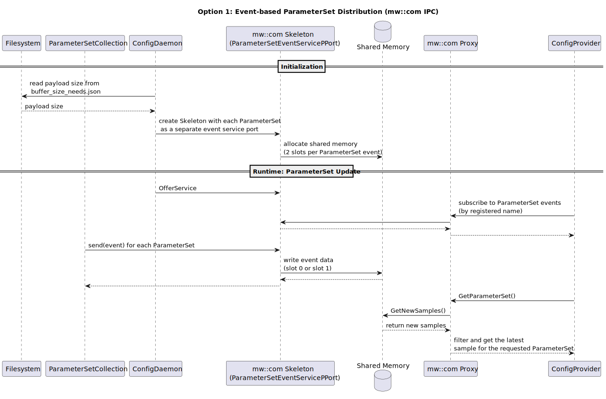
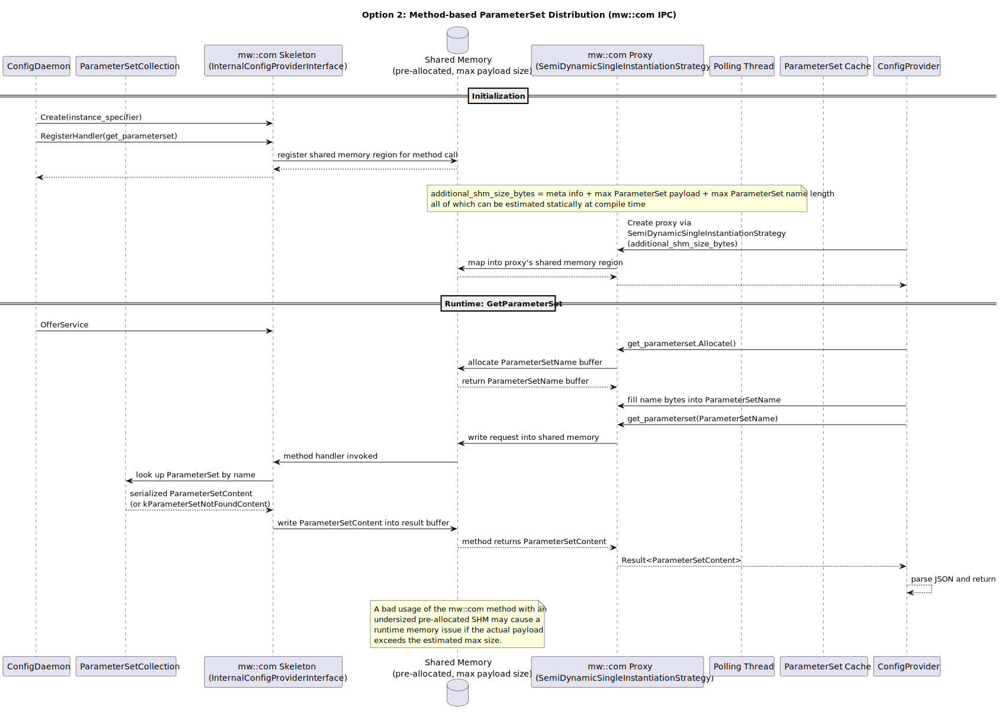

# Design Options: Migration to mw::com based IPC communication between ConfigDaemon and ConfigProvider

## 1. Context and Motivation

The IPC communication of the `InternalConfigProvider` interface between `ConfigDaemon` and `ConfigProvider` is being migrated from `mw::com` to `mw::com`. The interface exposes one event (`InitialQualifier`) and one method (`GetParameterSet`), both of which use `std::string` — a dynamically sized type. A direct dependency swap is not feasible because, unlike `mw::com`, `mw::com` does not support dynamic memory allocation by design. Two viable approaches to address this constraint are identified:

1. **Event-based**: `ConfigDaemon` exposes each `ParameterSet` as a separate mw::com event with a statically estimated payload size on skeletons´ side. `ConfigProvider` subscribes to these events and returns the latest cached value from `GetParameterSet`.

2. **Method-based**: `ConfigProvider` pre-allocates a fixed-size shared-memory region when constructing the mw::com proxy. This region is used for the `GetParameterSet` request and response buffers, keeping the main method-call logic largely unchanged.

## 2. Common Changes (Both Options)

Regardless of the chosen option, the `ParameterSet` payload size must be estimated statically.

The current `GetParameterSet` return payload uses a human-readable semantic format, for example:

    "{"parameters":{"param1":10,"param2":[181,182,-180.0],"param3":[[1,2],[3,4],[5,6]]},"is_calibratable":true,"qualifier":"Default"}"

Floating-point values in this format have variable character length (e.g. `'-3.40282e+38'` vs `'0'`), making compile-time size estimation unreliable. The solution is to encode parameter values as raw hex bytes instead:

    "{"parameters":{"param1":000A,"param2":[43350000,43360000,c3340000],"param3":[[0001,0002],[0003,0004],[0005,0006]]},"is_calibratable":true,"qualifier":"Default"}"

With this encoding the payload size per `ParameterSet` is fixed and can be determined at compile time from `default_parameter_set_collections.json` and `coding_config.json`.

## 3. Option 1: Event-based Approach
### 3.1 Overview

`ConfigDaemon` exposes each `ParameterSet` as a separate event. Two slots are allocated per event so that `ConfigDaemon` can update a `ParameterSet`'s value while a client is still reading the previously updated slot. The size of each slot equals the payload size of the corresponding `ParameterSet`.

Rather than fetching a `ParameterSet` on demand during a `GetParameterSet` method call, `ConfigDaemon` sends an event update for each `ParameterSet` when it is loaded into `ParameterSetCollection` and again whenever it is modified.

The client application registers the list of `ParameterSet` names it requires at `ConfigProvider` construction time. `ConfigProvider` subscribes to the corresponding events at runtime. `GetParameterSet` reads the latest value by calling `GetNewSamples` on the subscribed event, which reads directly from the shared-memory event slot.

### 3.2 Sequence Diagram

GetParameter with event-mode Diagram sequence diagram

## 4. Option 2: Method-based Approach
### 4.1 Overview

When `ConfigProvider` constructs the mw::com proxy it uses `SemiDynamicSingleInstantiationStrategy`, passing an `additional_shm_size_bytes` value equal to the statically estimated maximum `ParameterSet` payload size. This pre-allocates the shared-memory region that the method's request/response buffers use at runtime in addition to shared-memory needs of the host app for its own communication.

At runtime, a call to `GetParameterSet(name)` allocates a `ParameterSetName` buffer in shared memory, writes the requested name into it, and issues the `get_parameterset` method call. The skeleton's method handler looks up the name in its internal `ParameterSetCollection` and writes the serialized content back into a `ParameterSetContent` buffer in the same shared-memory region.

### 4.2 Sequence Diagram

GetParameter with method-mode Diagram sequence diagram

## 5. Comparison Summary

| Aspect | Option 1 (event-based approach)                                                                                                                     | Option 2 (method-based approach) |
|--------|----------------------------------------------------------------------------------------------------------------------------------------------------|------------------------------|
| **Compile-time Preparation** | Event names, IDs, and slot counts must be written into `mw_com_config.json`, requiring compile-time generation of that file. | original `mw_com_config.json` of host app is not affected; no generation step is needed for additional SHM size |
| **Proxy Creation** | Requires switching to a generic proxy. | Requires a new `mw::service` strategy (`SemiDynamicSingleInstantiationStrategy`) to pass the pre-allocated SHM size when creating the proxy. |
| **Service Creation** | Requires switching to a generic skeleton. | No change to the skeleton. |
| **Runtime Performance** | `GetParameterSet` reads directly from a shared-memory event slot — no service-side involvement at call time. | Each `GetParameterSet` call invokes the skeleton's method handler, which requires round-trip participation of the service process. Higher per-call overhead. |
| **Memory Usage** | `ConfigDaemon` allocates 2 slots per `ParameterSet` event: `2 × (sum of all ParameterSet payloads) + N × (event metadata)`. | Each client allocates one SHM region sized to the clients´ largest possible `ParameterSet` payload: `client_count × (max_payload + method metadata)`. |
| **Implementation Effort** | High — the core `ParameterSet` supply logic changes from a reactive method-call model to an event-push model. | Low — the existing method-call logic remains largely unchanged. |
| **Limitations** | A misbehaving client that holds both event slots simultaneously can block `ConfigDaemon` from updating `ParameterSet` values and, so, interfere with other unrelated clients. | Underestimating the maximum payload size at compile time leads to a runtime memory error when the actual payload exceeds the pre-allocated SHM region. |

## 6.Conclusion
We decide to go with Option 2, as it shows much less memory usage in our scenario, better FFI and has less implementation effort.
